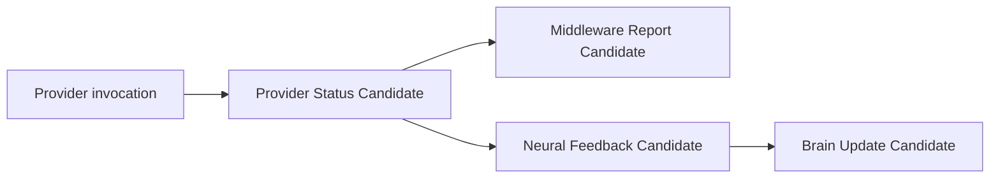

# Cognitive Provider Status Candidate Model v1

## Purpose

`provider_status_candidate` allows Middleware to report a bounded observation about a Provider invocation to Neural Governance. It is not a final health diagnosis, a truth claim, or a capability-admission decision.

## Required payload

| Field | Meaning |
|---|---|
| `availability` | Availability observation candidate for this invocation. |
| `latency` | Bucketed latency candidate; raw timing is intentionally omitted from replay identity. |
| `quality_candidate` | Invocation-quality candidate, not a quality fact. |
| `failure_pattern` | Observed fallback, unavailable-output, or error pattern candidates. |
| `resource_usage_candidate` | Bounded resource-use observation candidate. |

Provider identity, context reference, uncertainty, constraints, and trace are retained by the shared Candidate contract.

## Flow

## Boundaries

- Status can describe fallback or degraded output without changing the active Goal, Attention Authority, or Reality.
- Status does not directly mutate Self State or Attention. It may support future candidates through Neural Feedback.
- A repeated failure pattern is not by itself lifecycle deprecation, calibration, admission, or model replacement.
- This V1 model records local CPU use and bucketed latency only; it does not implement resource allocation or provider-health Runtime.
