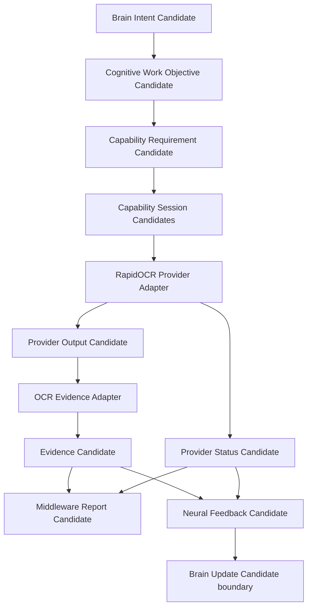

# Cognitive Real OCR Provider Adapter Architecture v1

## Phase

`Phase-Cognitive-Real-Provider-Adapter-Skeleton-v1-001` is a V1 controlled skeleton implementation. It connects one bounded local OCR Provider to the existing A-route Candidate flow; it is not a general OCR feature, a camera integration, or a Runtime.

## Controlled chain

## Adapter responsibility

`cognitive/middleware/ocr_provider_adapter.py` is the only V1 component that invokes a local OCR library. It accepts an active `text_understanding` capability requirement and a static fixture. It returns two Candidates:

- `provider_output_candidate`: raw OCR observation, text candidates, regions, confidence, uncertainty, and trace reference;
- `provider_status_candidate`: availability, latency bucket, quality candidate, failure pattern, and resource-use candidate.

The preferred local artifact is RapidOCR PP-OCRv5 Mobile. If the installed local runtime cannot produce usable output for that artifact, the Adapter records that condition as a failure/degradation candidate, then may use the local RapidOCR default engine as an explicit fallback. This is Provider-level handling, not a Brain, Neural, or Middleware truth decision.

## Frozen boundaries

- Brain creates an Intent; it does not import or call RapidOCR.
- Neural Governance translates Intent and aggregates feedback; it does not execute OCR.
- Middleware creates Candidate-only session stages; it does not decide cognitive completion.
- Provider output is not Reality, a fact, a decision, or an action.
- The OCR Evidence Adapter preserves OCR observations. It does not correct text, infer semantics, or assert that a region is an exit.
- No camera, live video, hardware, scheduler, legacy runtime, task manager, model-manager main logic, UI, Decision, Action, or Reducer mutation is introduced.

## Fixed fixtures

`cognitive/validation/fixtures/real_ocr_v1/` contains only deterministic English static images: clear text, partially occluded text, and low-quality text. They validate control and trace boundaries, not model accuracy.
