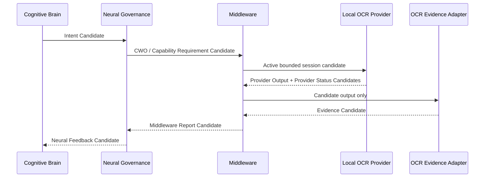

# Cognitive Real Provider Evidence Flow v1

## Evidence path

## Evidence preservation contract

The Evidence Adapter copies these Provider Output fields without interpretation:

- `raw_output`
- `text_candidates`
- `region_candidates`
- confidence and uncertainty
- provider/output/session/work-objective references

It must not repair OCR text, classify text as an exit, convert output into a situation fact, or issue an action request. `EvidenceCandidate.as_candidate()` explicitly retains `truth_confirmed=false`, `decision_requested=false`, and `action_requested=false`.

## Feedback semantics

Neural feedback contains only `coverage_candidate`, `missing_information`, `quality_candidate`, and `next_attention_candidate`. A text result can be available while spatial relationship information remains missing. This is the intended result: OCR evidence answers only part of the CWO and never decides whether the world has been understood.
