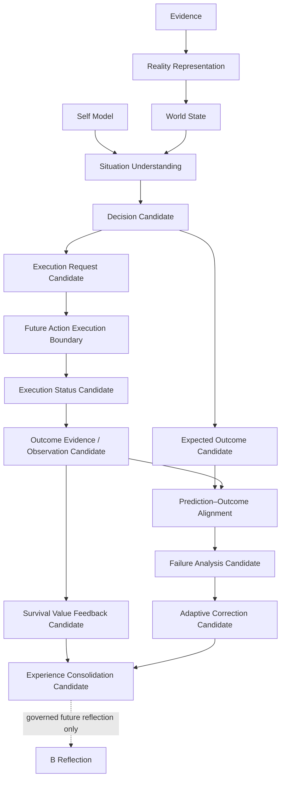

# Reality Action Feedback Loop Whitebox v1

The Whitebox shows the Decision/Action/Outcome/Evaluation separation,
provenance, expected-versus-observed difference, failure-class uncertainty,
and every candidate's future-only status. It cannot expose an execution
control, auto-correct an Action, or mutate State.
