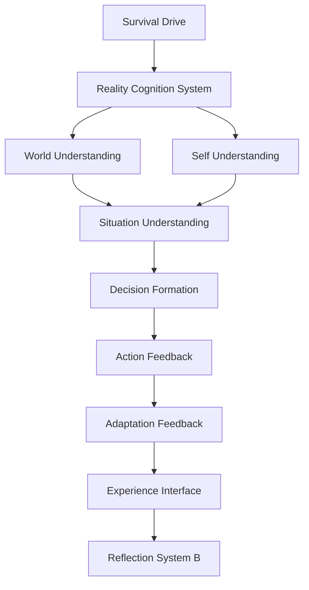

# A-Route Reality Cognition Final Architecture Map v1

This map is architectural only.
Action Feedback contains an execution boundary, not an Action Runtime.
Experience Interface exports candidates, not memory writes or live B control signals.
