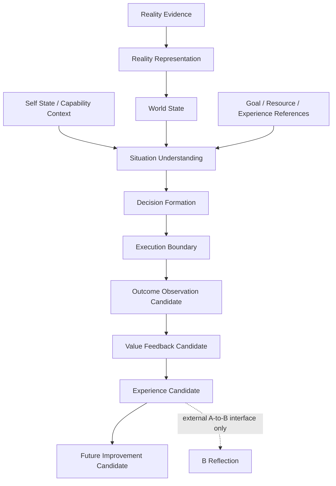

# Reality Cognition System Whitebox v1

The Whitebox presents system inputs, internal candidate transitions, external
outputs, trace references, uncertainty, and the delayed A-to-B interface. It
does not expose internal modules as controls, provide execution buttons, or
claim that an Action Runtime exists.
