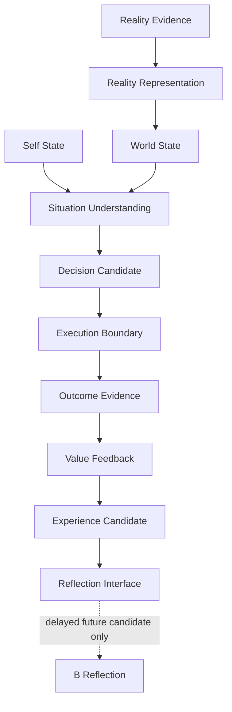

# A-Route Final Whitebox v1

The final Whitebox exposes provenance, uncertainty, authority boundary, baseline status, and handoff status.
It does not expose action controls, B-to-current-A control, or State mutation controls.
