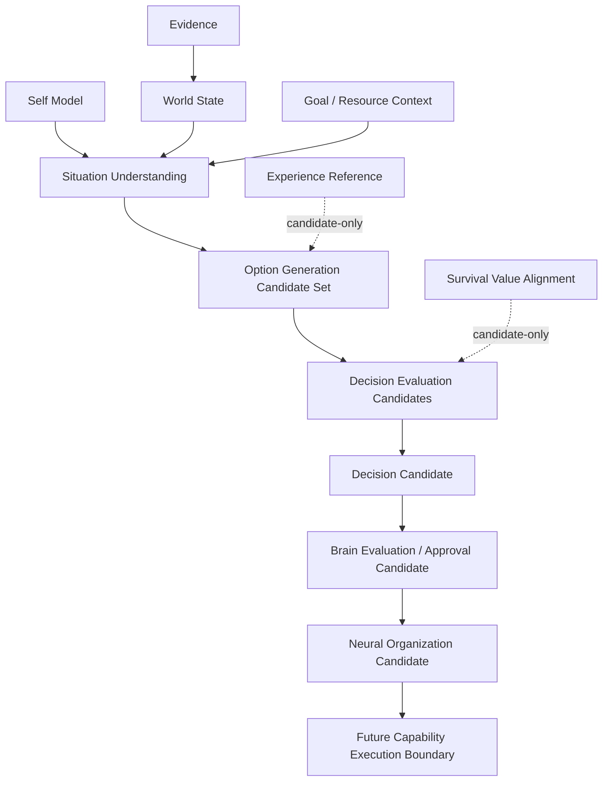

# Reality Decision Formation Whitebox v1

The future Whitebox shows option assumptions, priority conflicts, evidence and
experience references, capability/resource constraints, confidence/unknowns,
and path class (Fast/Normal/Deep). It must never expose an action control,
automatically choose an option, or hide the Decision/Action boundary.
