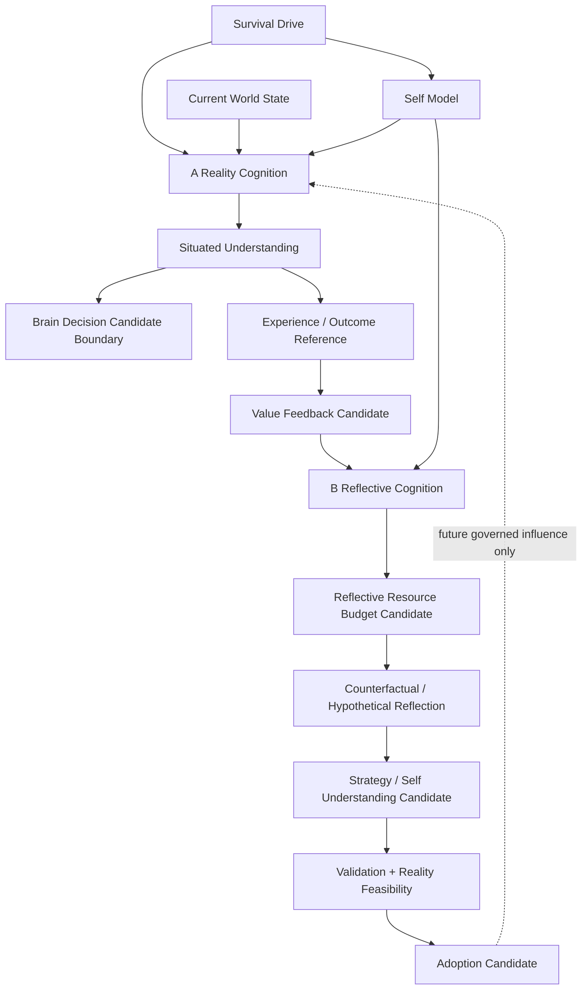

# Reality–Reflection Dual Loop Whitebox v1

The Whitebox must show whether each node is Reality-bound or hypothetical,
its trace reference, uncertainty, depth/budget, validation/adoption status,
and the absence of a direct B-to-A control path. It is read-only and cannot
serve as a Sandbox, action console, or State mutation interface.
