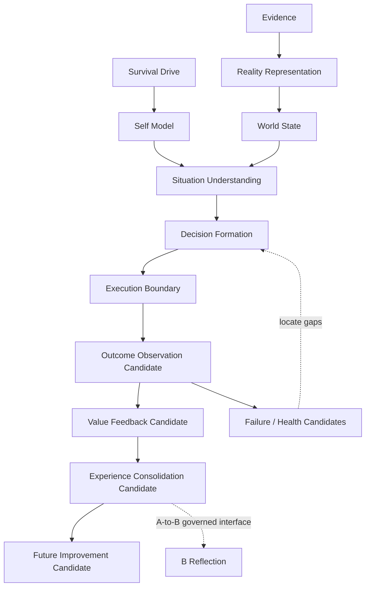

# A-Route Reality Cognition Foundation Whitebox v1

The future Whitebox must display layer reference, candidate status, evidence
provenance, self-capability/resource context, uncertainty, failure locality,
and A/B interface status. It must not display an action control, claim runtime
completion, hide a boundary, or mutate State.
