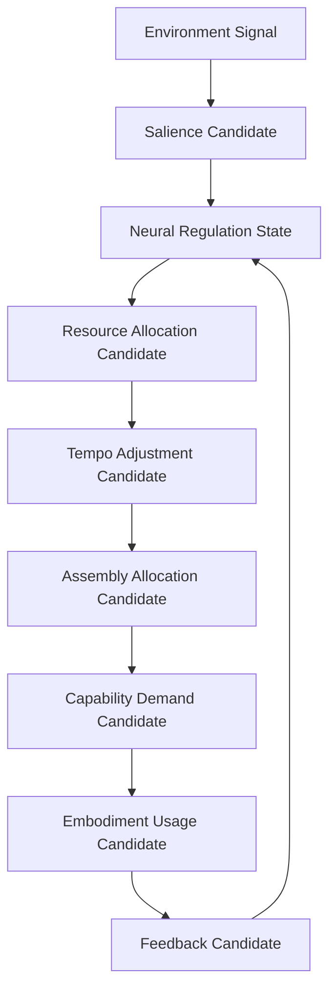

# Cognitive Regulation Feedback Loop v1

```mermaid
flowchart TD
    E[Environment Signal] --> S[Salience Candidate]
    S --> R[Neural Regulation State]
    R --> A[Resource Allocation Candidate]
    A --> T[Tempo Adjustment Candidate]
    T --> AS[Assembly Allocation Candidate]
    AS --> C[Capability Demand Candidate]
    C --> U[Embodiment Usage Candidate]
    U --> F[Feedback Candidate]
    F --> R
```

All edges are candidates. No automatic real Provider, device, Assembly, Attention, State, or learning update is introduced.
