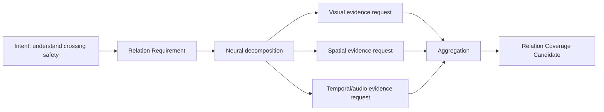

# Cognitive Relation Seeking Model v1

## Purpose

Relation Seeking lets a Cognitive Intent request understanding of how entities, states, and events may be related. It prevents the capability path from collapsing a cognitive need into disconnected object detections.

Example: intersection safety is not satisfied by detecting a vehicle alone. It may require understanding the relation among vehicle, pedestrian, road boundary, traffic indication, and temporal motion.

## Relation classes

| Relation class | Question represented | Boundary |
|---|---|---|
| Spatial | Where is A relative to B? | A spatial candidate is not a calibrated fact. |
| Temporal | How are A and B ordered or changing over time? | Temporal alignment does not prove causation. |
| Interaction | How may A affect, constrain, or respond to B? | Interaction is a candidate relation requiring evidence. |
| Causal Candidate | What possible cause-effect relation should be investigated? | It is explicitly not causal truth. |

## Model

## Roles

- Brain specifies which relation is cognitively relevant in its current context.
- Neural encodes relation requirements, decomposes them, aligns returned evidence, and emits relation-coverage or conflict candidates.
- Middleware organizes feasible capability candidates.
- Providers return outputs packaged as Evidence Candidates.

Neither Neural nor Middleware may promote a requested relationship into reality truth, decision, or action.

## Required constraints

Every relation request records:

- participating entity/state references;
- relation class;
- contextual scope;
- temporal/spatial coverage requirement where relevant;
- uncertainty target;
- evidence and resource constraints;
- trace linkage to the parent intent.
