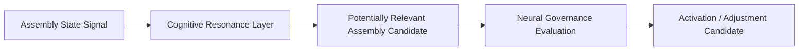

# Cognitive Resonance Layer Architecture v1

Resonance is relevance matching and propagation metadata, not a communications bus, Event Engine, Scheduler, or Decision maker. Assembly A cannot activate Assembly B directly.
