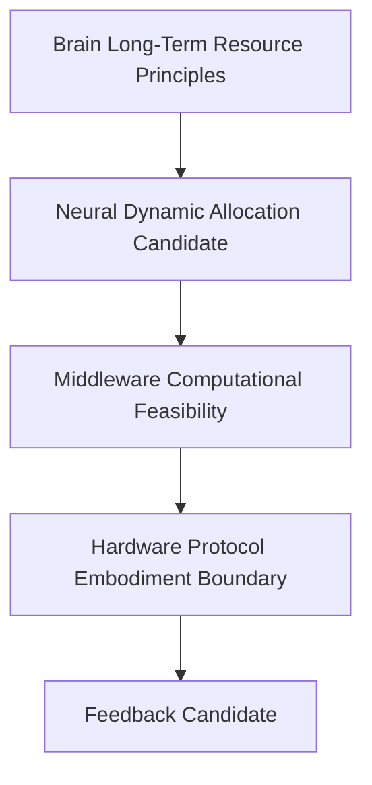

# Cognitive Resource Allocation Model v1

Brain sets long-term policy such as low-power daily operation and goal-value priorities. Neural forms dynamic allocation candidates. Middleware maps computation feasibility. Hardware Protocol governs body execution. None of these contracts schedules, executes, or mutates State.
