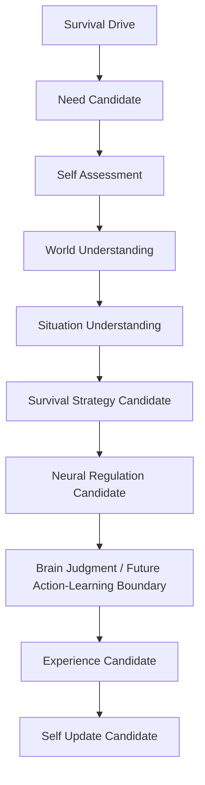

# Cognitive Self-Driven Cognition Loop Model v1

## Architecture loop

## Interpretation

The loop is a cognitive organization model, not a continuously executing
agent loop. “Action / Learning” is deliberately represented as a future
boundary: no Action, Decision, automatic learning, autonomous scheduling, or
State mutation is created by this phase.

Self Assessment consults Self Capability Context; World Understanding and
Situation Understanding preserve the evidence/reality/situation separation.
Self Update follows `Candidate → Validation → Adoption` and is never a
runtime self-write.
