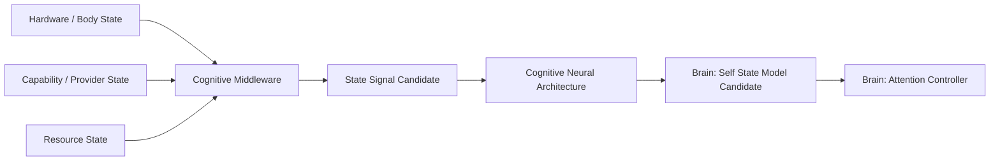

# Self State Architecture Reconciliation v2

## Ownership decision

`Self State Model` belongs to the **Cognitive Brain**. It is Luna's current cognitive representation of its own availability, reliability, constraints, attention/load, and usable knowledge. It is neither a Body state store nor a Middleware-owned capability registry.

## Source and synthesis flow

## Distinctions

| Object | Ownership | Meaning | Is not |
|---|---|---|---|
| Current Body State | Body; observed/reported through Middleware | physical device/sensor condition, battery, thermal, connectivity | Cognitive Self Model |
| Capability State | Middleware-provided candidate | provider/device availability, health, lifecycle, reliability | Goal or Attention authority |
| Resource State | Middleware-provided candidate | compute, storage, network, energy constraints | cognitive decision |
| Cognitive Self Representation / Self State Model | Cognitive Brain | context-bound synthesis of what Luna can currently support, trust, attend to, and sustain | Identity, Personality, Emotion, persistent State authority |

## Boundary rule

Middleware does not own, write, or mutate Self State. It produces candidate observations only. Neural Layer transports/classifies those State Signals. Brain may form a Self State Candidate and Attention Controller may use it as a constraint. Reducer remains the only State Mutation Authority.

## Status

`COGNITIVE_SELF_STATE_ARCHITECTURE_RECONCILIATION_V2_READY_WITH_NOTES`

`WAITING_FOR_USER_TERMINAL_VERIFICATION`
