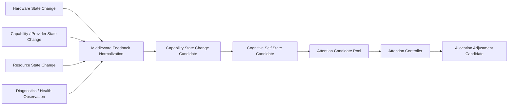

# Self State Feedback Architecture v1

## Purpose

Luna must not wait for the Brain to ask whether its body/capabilities remain usable. Hardware, capability, resource, and provider changes can emit bounded feedback candidates that become inputs to Cognitive Self State. This is feedback about Luna's current ability to gather evidence—not a replacement for external reality understanding.

## Feedback path

## Candidate classes

| Source | Middleware output | Self State dimension | Possible Attention effect |
|---|---|---|---|
| Camera lens obstruction | `capability_state_change_candidate` with visual reliability decrease | Capability State / Cognitive Reliability State | Increase verification need; reduce dependence on visual evidence candidate |
| Device thermal limit | `hardware_safety_event_candidate` and resource constraint | Resource State / Capability State | Lower depth/cadence; seek alternate evidence candidate |
| Battery low | `resource_state_change_candidate` | Resource State | Reduce exploration/simulation request candidate; preserve high-risk attention |
| OCR provider unavailable | `provider_health_change_candidate` | Capability State / Knowledge Availability State | Remove OCR from feasible bundle candidate; preserve information need |
| High latency/error rate | `reliability_state_candidate` | Cognitive Reliability / Load State | Increase uncertainty and evidence diversity request candidate |

## Authority boundary

Middleware feedback may **inform** Self State but cannot write Self State, Context, Goal, Attention Allocation, Memory, or Reducer State. The Brain aggregates candidate sources; Attention Controller creates an allocation adjustment candidate only after its normal governance process.

## Protective feedback rule

For a hardware safety event, a future device-local fail-safe may protect the device itself. Middleware reports the event; it cannot translate it into a route change, external action, or truth assertion. The Brain may later create a new information-need or attention-adjustment candidate.

## Status

`COGNITIVE_SELF_STATE_FEEDBACK_ARCHITECTURE_READY_WITH_NOTES`

`WAITING_FOR_USER_TERMINAL_VERIFICATION`
