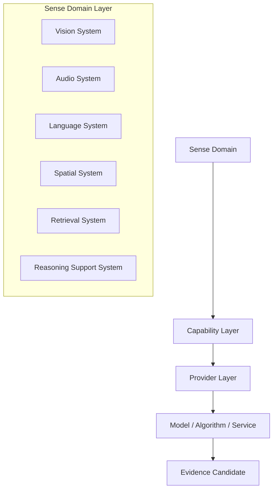

# Cognitive Sense Capability Architecture v1

## Scope

This architecture governs **software sense capability** inside Cognitive Middleware. Hardware Embodiment is frozen at an interface placeholder and is not designed, registered, or implemented in this phase.

## Sense Capability structure

## Domains and capabilities

| Sense Domain | Software capability examples | Provider examples | Boundary |
|---|---|---|---|
| Vision System | Visual Input Interpretation, Object Understanding, Text Understanding, Scene Understanding, Spatial Understanding, Tracking | YOLO, OCR, SAM, VLM, SLAM | Provider output is not fact. |
| Audio System | Speech Signal Extraction, Sound Event Understanding, Speaker/Direction Cue | ASR, audio event model, diarization provider | Does not decide user intent by itself. |
| Language System | Language Input Parsing, Intent Evidence, Textual Context Evidence | parser, language model/service | Language evidence is not cognitive authority. |
| Spatial System | Spatial Relation, Mapping Support, Motion/Pose Evidence | SLAM, odometry, depth, mapping service | Does not route or act. |
| Retrieval System | Historical Pattern Retrieval, Knowledge/Document Retrieval Support | retrieval algorithm/service | Retrieval is guidance/evidence candidate, not memory truth. |
| Reasoning Support System | Structured analysis support, external computation support, consistency aid | algorithm/model/service | Cannot replace Brain Workspace, Simulation, or Evaluation. |

## Core rule

`Sense Domain → Capability → Provider → Evidence Candidate`

Brain requests a Capability in a Sense Domain. Middleware organizes a Provider Candidate or Composite Capability Candidate. Brain never requests a named model.

## Status

`COGNITIVE_SENSE_CAPABILITY_ARCHITECTURE_READY_WITH_NOTES`

`WAITING_FOR_USER_TERMINAL_VERIFICATION`
