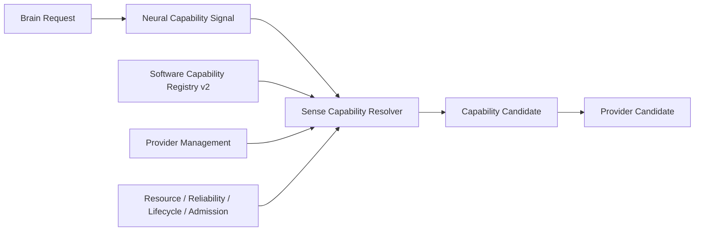

# Sense Capability Resolver v2

## Upgrade

Sense Capability Resolver v2 specializes the existing Capability Resolver boundary for software Sense Domain management. It accepts a Brain-originated capability need through Neural Layer, resolves eligible Capability and Provider Candidates, and returns no cognitive conclusion or execution.

## Resolver contract

| Stage | Input | Output | Forbidden |
|---|---|---|---|
| Need classification | Neural Capability Signal | Sense Domain + Capability requirement candidate | create Goal or Attention |
| Capability resolution | registry/contract/admission information | Capability Candidate | choose cognitive answer |
| Provider resolution | provider management/resource/reliability | Provider Candidate Set | direct provider execution |
| Constraint reporting | lifecycle/health/resource constraints | failure/degradation/constraint candidate | hide uncertainty or mutate State |

## Example

For `understand the road intersection` with low-latency constraint, Resolver may return a Vision/Scene Understanding Capability Candidate with multiple Provider Candidates. It does not decide that the road is safe, choose an action, or start a model.

## Status

`COGNITIVE_SENSE_CAPABILITY_RESOLVER_V2_READY_WITH_NOTES`

`WAITING_FOR_USER_TERMINAL_VERIFICATION`
