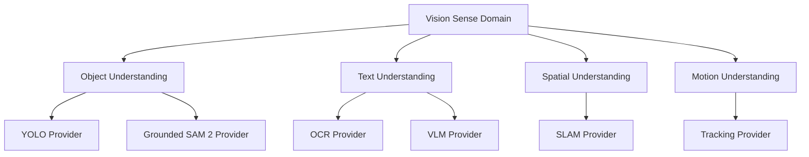

# Cognitive Sense Domain Architecture v1

## Principle

Luna organizes embodiment-facing capability by **Sense Domain**, not by individual model. A Sense Domain describes what kind of information a body can supply. Capability describes what understanding/evidence operation is requested. Provider describes a concrete model, device, or service that may satisfy it.

`Sense Domain ≠ Model`

## Sense Domain hierarchy

| Sense Domain | Example capabilities | Example providers |
|---|---|---|
| Vision | Visual Capture, Object Understanding, Text Understanding, Scene Understanding, Spatial Understanding, Motion Understanding, Identity Understanding | camera, YOLO, Grounded SAM 2, OCR, VLM, depth, SLAM |
| Audio | Audio Capture, Sound Event Understanding, Speech Signal Extraction, Speaker/Direction Cue | microphone, audio event model, ASR provider |
| Language | Human Language Input, Intent Evidence, Textual Context Evidence | ASR text output, text parser, language provider |
| Touch | Contact, pressure, haptic, surface interaction evidence | touch sensor, wearable haptic/pressure device |
| Proprioception | orientation, motion, position, device pose, gait/movement state | IMU, GPS, pose/odometry provider |
| Environment | temperature, light, proximity, air, spatial/environmental condition | ToF, light sensor, environmental sensor, external service |

## Vision example

## Boundary

Brain requests a capability such as `Text Understanding` or `Spatial Understanding`, never `call Grounded SAM 2`. Middleware resolves Provider Candidates from the governing registry, resource state, reliability/calibration, and admission constraints.

## Status

`COGNITIVE_SENSE_DOMAIN_ARCHITECTURE_READY_WITH_NOTES`

`WAITING_FOR_USER_TERMINAL_VERIFICATION`
