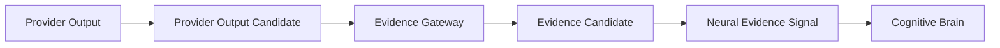

# Sense Evidence Flow v1

## Flow

Provider outputs are not cognitively consumable until Evidence Gateway packages them. This preserves source, role, scope, time, confidence, uncertainty, reliability, composition membership, and trace before Neural Layer transports Evidence Signal to Brain.

## Evidence Gateway responsibilities

| Input | Gateway operation | Output |
|---|---|---|
| Model/algorithm/service result | normalize provider-specific envelope | provider output candidate |
| Capability/Provider Candidate references | attach requested capability purpose and provider role | provenance/role linkage |
| Resource/reliability/lifecycle data | attach delivery health and constraint context | reliability/failure/degradation candidate |
| Composite Capability membership | preserve individual provider contributions and conflict | Evidence Candidate Set / conflict candidate |

## Boundaries

- Gateway does not decide that an object, text, scene, or risk is true.
- Neural Evidence Signal does not update Context directly.
- Brain evaluates Evidence Candidate against Context, Goal, Attention, and current evidence.
- Provider output cannot bypass Evidence Gateway.

## Status

`COGNITIVE_SENSE_EVIDENCE_FLOW_READY_WITH_NOTES`

`WAITING_FOR_USER_TERMINAL_VERIFICATION`
