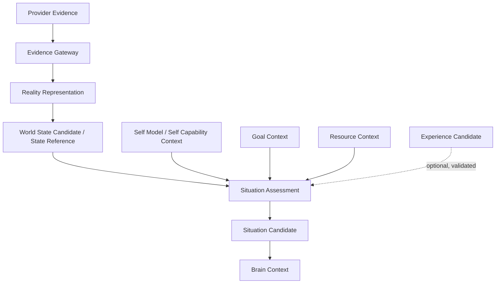

# Situated Understanding Whitebox v1

The future local Whitebox must expose provenance and uncertainty at each
transition: `evidence_ref`, representation reference, relevant Self Capability
boundary, goal/resource context, unresolved unknowns, and `trace_ref`. It must
show a Situation Candidate, not a Decision or Action.

The presentation is observational only: it is not a runtime control surface,
provider console, or State mutation path.
