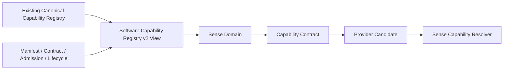

# Software Capability Registry v2

## Position

Software Capability Registry v2 is a conceptual reorganization view over the existing canonical Capability Registry, manifests, admission, lifecycle, baseline, calibration, and diagnostics assets. It registers **Capability Contracts**, not individual models as cognitive units. A model/algorithm/service appears only as a Provider bound to one or more capability contracts.

## Registry entry concept

| Field | Meaning | Boundary |
|---|---|---|
| `capability_id` | stable software capability identity | not a model id or Goal |
| `domain` | Sense Domain classification | not an Attention allocation |
| `input` | accepted input/evidence requirement | no direct device/model call |
| `output` | expected candidate/evidence output type | not a truth assertion |
| `provider` | compatible provider candidates | provider availability ≠ invocation |
| `resource` | compute/memory/latency/network traits | constraint only |
| `reliability` | health/calibration/confidence metadata | reliability ≠ fact |
| `boundary` | allowed scope, forbidden scope, admission/protocol/lifecycle references | cannot confer Decision/Action/State authority |

## Registry relationship

## Reuse rule

This v2 view does not replace `luna_capability_registry_v1.json`; it maps existing entries into Sense Domain, Capability Contract, and Provider relations for Middleware resolution. No second registry, runtime loader, or model admission path is created.

## Status

`COGNITIVE_SOFTWARE_CAPABILITY_REGISTRY_V2_READY_WITH_NOTES`

`WAITING_FOR_USER_TERMINAL_VERIFICATION`
