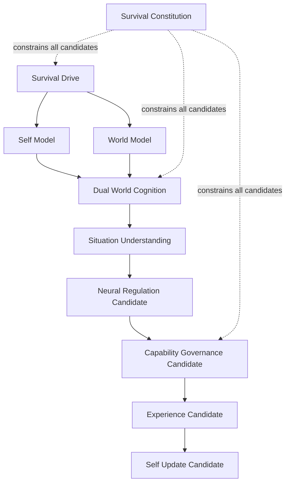

# Cognitive Survival Core Whitebox v1

## Display contract

The future Whitebox displays sources, candidate type, trace reference,
uncertainty, constitutional constraints, and boundary status. It must not show
a fabricated inner state as fact, expose an action control, or provide a
direct State-mutation path.
