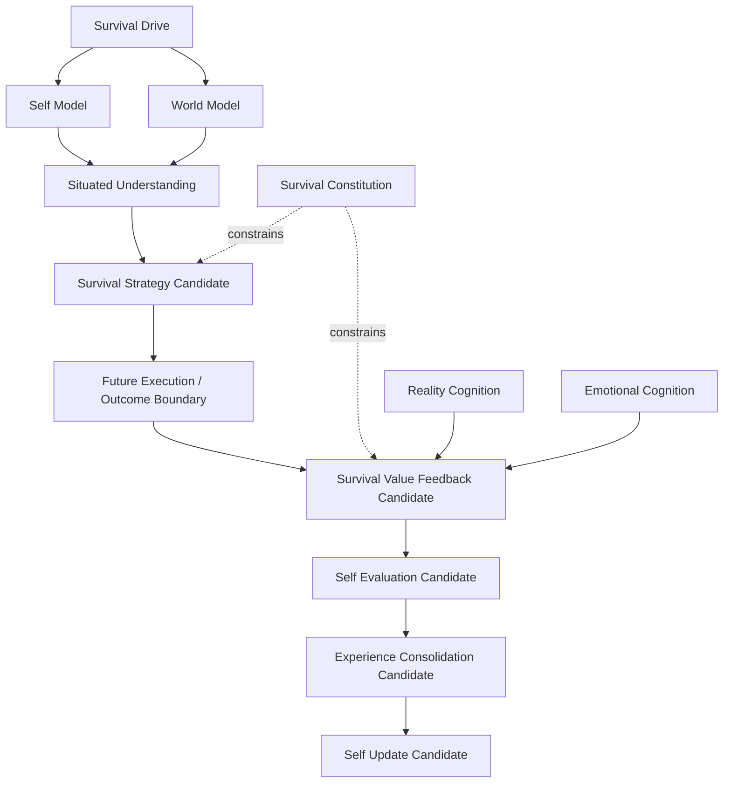

# Survival Value Loop Whitebox v1

## Display boundary

The future Whitebox shows candidate provenance, physical/capability/
relationship/meaning value dimensions, uncertainty, validation status, and
constitutional constraints. It cannot display a reward score as truth, offer
an execution button, or mutate Strategy, Self Model, Experience, or State.
