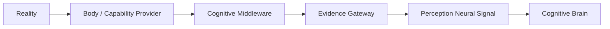
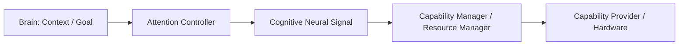
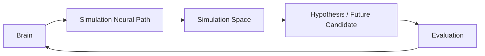

# Cognitive System Dataflow Model v2

## 1. Reality Perception Flow

Body/provider output is not automatically cognition. Middleware packages it as an Evidence Candidate with source, time, scope, confidence, uncertainty, reliability, and trace. Neural Layer classifies/transports the signal. Brain evaluates it against Context, Goal, and current evidence; no step confirms truth.

## 2. Cognitive Request Flow

Brain influences the body only by expressing an Attention-bound information/evidence need candidate. Middleware supplies capability alternatives and constraints. Provider execution is future admission-bound. Capability availability never creates a task, goal, or attention target by itself.

## 3. Simulation Flow

Simulation Flow is entirely internal. It is the architectural interface for a future B-route deep mode: expand Workspace/Simulation/Operation/Evaluation under Attention admission. It must not access real hardware, bypass Evidence Gateway, or write Reality State.

## Cross-flow separation

| Flow | May become | Must not become |
|---|---|---|
| Perception | Evidence / state / reflex candidate | fact, direct context mutation, action |
| Cognitive request | capability/request/session candidate | provider command, goal override, decision |
| Simulation | hypothesis/future/evaluation candidate | evidence, reality state, truth |

## Status

`COGNITIVE_SYSTEM_DATAFLOW_MODEL_V2_READY_WITH_NOTES`

`WAITING_FOR_USER_TERMINAL_VERIFICATION`
