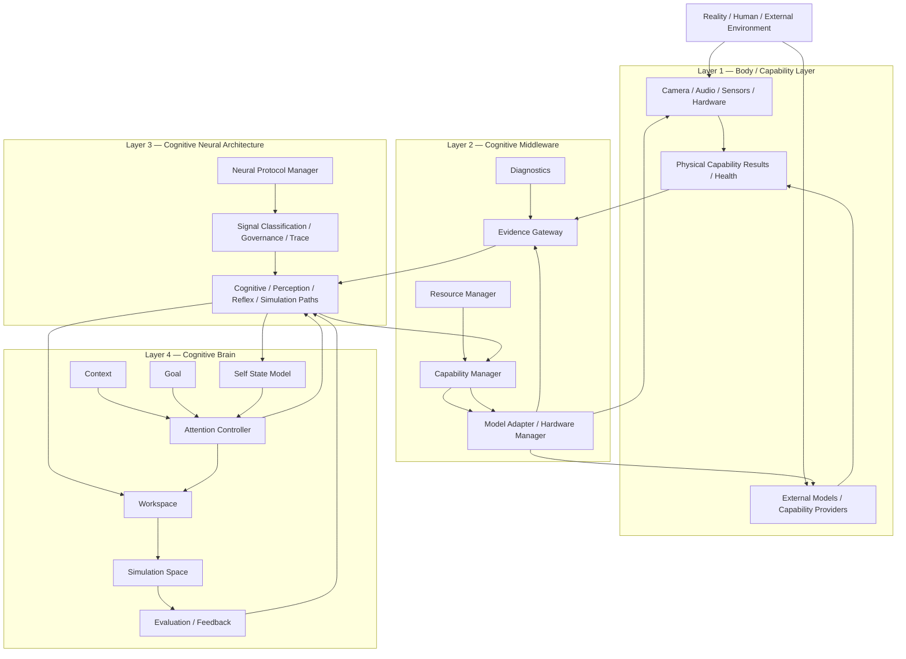

# Luna Cognitive System Overall Architecture v2

## Phase

- Phase: `Phase-Cognitive-System-Architecture-Reconciliation-v1-001`
- Execution mode: Planning Only / V0.
- Scope: four-layer ownership reconciliation only.
- No implementation, migration, protocol modification, model/hardware connection, or Cognitive Foundation change is authorized.

## Four-layer system

The Cognitive Neural Architecture occupies the boundary between Brain and Middleware because it separates cognitive meaning from capability mechanics. Brain does not need provider-specific execution details; Middleware does not interpret cognitive intent as a decision. Neural signals preserve intent, evidence, state, trace, and compatibility across that boundary.

## Bidirectional interpretation

| Direction | Flow | Meaning |
|---|---|---|
| Perception / feedback | Reality → Body → Middleware → Neural → Brain | External results are normalized into evidence/state/reflex signals before cognitive use. |
| Cognitive request | Brain → Neural → Middleware → Body | Attention-bound information need becomes a capability request candidate; it is not a direct device command. |
| Internal simulation | Brain → Simulation Neural Path → Simulation Space → Candidate → Evaluation | Hypothetical reasoning stays inside cognition and never becomes Reality evidence. |

## System invariant

No layer below Brain owns Goal, Attention, cognitive evaluation, truth, decision, or action authority. No layer above Body directly invokes hardware/providers. Reducer remains the only State Mutation Authority.

## Status

`COGNITIVE_SYSTEM_OVERALL_ARCHITECTURE_V2_READY_WITH_NOTES`

`WAITING_FOR_USER_TERMINAL_VERIFICATION`
