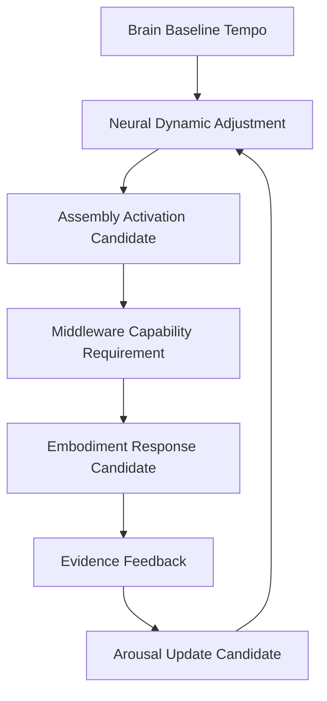

# Tempo Feedback Loop Model v1

```mermaid
flowchart TD
    B[Brain Baseline Tempo] --> N[Neural Dynamic Adjustment]
    N --> A[Assembly Activation Candidate]
    A --> M[Middleware Capability Requirement]
    M --> E[Embodiment Response Candidate]
    E --> F[Evidence Feedback]
    F --> U[Arousal Update Candidate]
    U --> N
```

Every edge is candidate-only. The loop is a governance model, not a Scheduler, Runtime, hardware stream, or automatic regulation engine.
