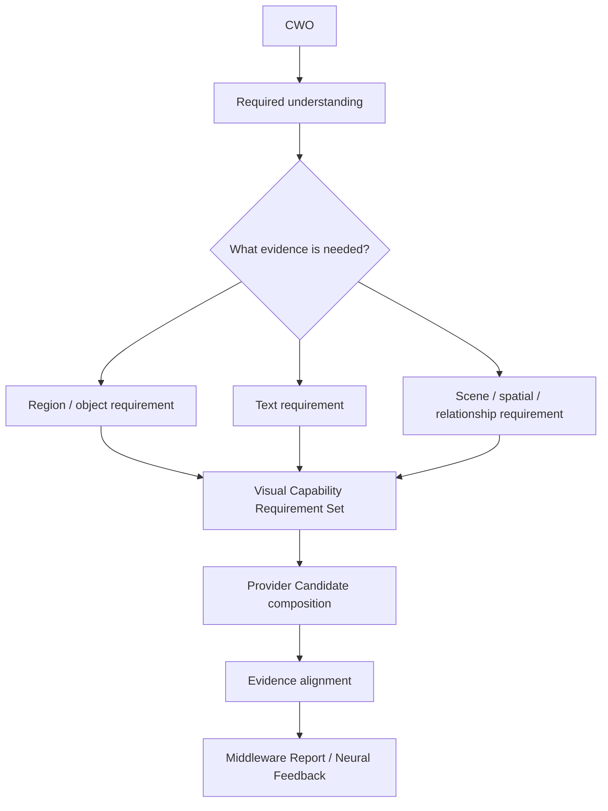

# Visual Capability Reintegration v1

## Problem addressed

Legacy visual processing can drift into `image → parallel models → result fusion`, which makes it unclear what is being sought, why a region matters, which output is useful, and how conflicts should be handled.

## Target visual path

## Sense capability role mapping

| CWO requirement | Sense Capability | Example Provider family | Returned evidence role |
|---|---|---|---|
| Identify a relevant region | Region/Object Understanding | Grounded SAM, segmentation, detection. | Region/target candidate. |
| Locate/read sign text | Visual Text Understanding | OCR, text detector/recognizer. | Text evidence candidate. |
| Understand environment structure | Scene Understanding | VLM, visual scene analysis. | Scene/relationship candidate. |
| Establish relative positions | Spatial Understanding | SLAM/depth/spatial provider. | Spatial relation candidate. |
| Compare change over time | Tracking/Motion Understanding | Tracker/motion provider. | Temporal/motion candidate. |

## Integration rules

1. A CWO determines evidence dimensions; models are Provider candidates, never direct Brain choices.
2. Providers may be composed only to close a declared coverage gap.
3. Evidence alignment preserves temporal/spatial scope and model disagreement as candidates.
4. No visual output directly updates Context/World Understanding or becomes a fact.
5. A-route does not create a visual Action Plan; B-route simulation/body logic remains excluded.

This is a visual capability architecture plan; no OCR/VLM/SAM/SLAM code path is connected or changed.
