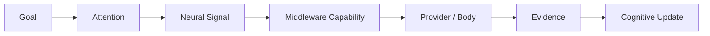

# Cognitive Whitebox Architecture v2

## Purpose

Cognitive Whitebox v2 is a future local, read-only architecture view of the four-layer cognitive chain. It explains why Luna sought information and how the evidence changed cognition. It is not a model-call dashboard, API log viewer, control plane, or State editor.

## Trace Object

| Field | Purpose | Boundary |
|---|---|---|
| `signal_type` | Attention, Capability, Evidence, State, Reflex, Adaptation, Simulation | Classification only, not authority |
| `source` | originating layer/module reference | Source does not imply decision ownership |
| `destination` | receiving layer/module reference | Destination does not grant State mutation |
| `priority` | requested/allocated/reduced relevance candidate | Priority is not truth/value confirmation |
| `lifecycle` | create, transport, receive, update, reduce/suspend, close | Observability only, not runtime scheduling |
| `evidence_ref` | evidence candidate/trace reference | Evidence is not confirmed fact |
| `capability_ref` | capability bundle/session/provider reference | Availability/execution distinction remains visible |

## Required panels

1. **Goal / Context:** active direction, unknowns, and sufficiency reason.
2. **Attention:** source candidates, allocation, lifecycle, suppression/reduction rationale.
3. **Neural Signal:** type, source, destination, protocol version, boundary validation, timeline.
4. **Middleware Capability:** feasibility, resource/reliability constraints, bundle/session candidates.
5. **Provider / Body:** raw activity summary and capability/health condition—not a provider command console.
6. **Evidence:** source/scope/time/confidence/uncertainty/conflict/trace.
7. **Cognitive Update:** Context/Workspace/Evaluation/Self State/Feedback candidates.

## UI prohibition

The local web page may render traces only. It cannot invoke a model/provider, alter Attention priority, create a Goal, close a session, approve evidence as fact, or mutate State. Existing Model Test Lens is a candidate presentation base only after a separate authorized migration review.

## Status

`COGNITIVE_WHITEBOX_ARCHITECTURE_V2_READY_WITH_NOTES`

`WAITING_FOR_USER_TERMINAL_VERIFICATION`
