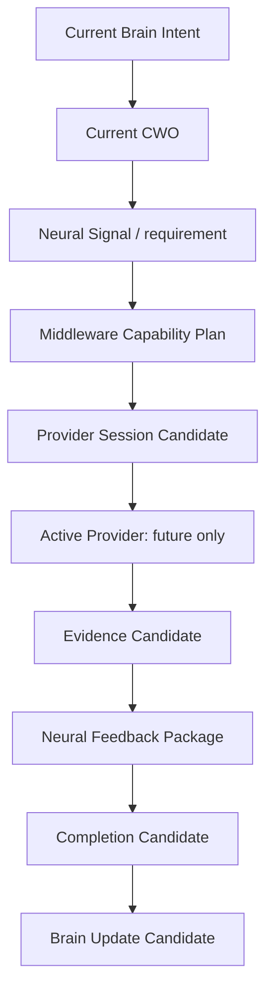

# Controlled Invocation Whitebox Architecture v1

## Purpose

The first controlled-invocation whitebox must make the cognitive cause and governance of a Provider request observable. It should never present a provider result as the primary system truth.

## Required panels

| Panel | Required display |
|---|---|
| Current Brain Intent | Purpose, context ref, uncertainty target, and constraints. |
| Current CWO | Required understanding, observation/relationship coverage, depth, completion condition. |
| Neural signal | Protocol/trace, child requirements, and requested coverage. |
| Middleware capability plan | Situation report, capability candidates, resource/lifecycle constraints, alternatives. |
| Provider session | Candidate/admission/lifecycle status; Provider details are nested. |
| Evidence | Source, Provider, capability, observation, confidence, uncertainty, scope, conflict, trace. |
| Feedback / completion | Middleware Report, Neural alignment, unresolved unknowns, and continue/refine/close candidates. |

## Whitebox rules

- No direct “run model” cognitive-control button.
- Provider status is execution metadata, not cognitive completion.
- Every evidence item exposes uncertainty and provenance.
- All live control/invocation UI remains out of scope until a separately approved implementation phase.

This is a UI architecture plan only; existing Model Test Lens UI is not modified.
