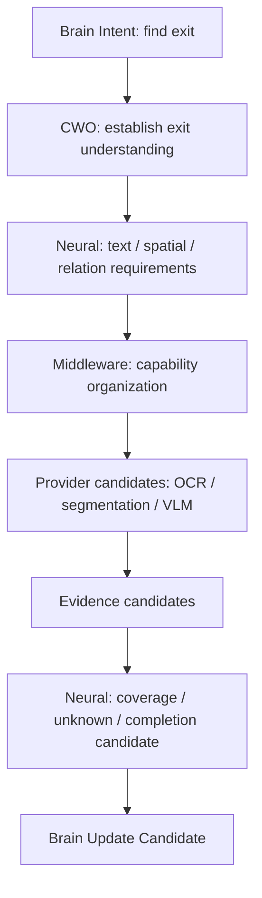

# Cognitive Whitebox Reintegration Plan v1

## Objective

Reposition the existing Model Test Lens from a model-result/test-board display into a read-only Cognitive Whitebox that exposes why evidence was requested, how capability work was organized, and what uncertainty remains.

## Old-to-new presentation mapping

| Existing display | Cognitive Whitebox replacement |
|---|---|
| Camera / model / box result | Intent and CWO lineage preceding every evidence item. |
| OCR result | Text Evidence Candidate with scope, confidence, uncertainty, and provenance. |
| Detection or segmentation overlay | Region/Object Evidence Candidate plus capability requirement/coverage relation. |
| Model-selection panel | Middleware Provider Candidate Set, lifecycle/resource/fallback metadata. |
| Observation attention panel | Brain Attention requirement and Neural signal/capability coverage; no UI control authority. |
| Multi-model panel | CWO-derived capability composition and conflict/alignment evidence. |
| Runner log | Provider Session candidate/status and trace lifecycle. |
| Situation panel | Brain Update Candidate, remaining unknown, and explicit non-fact label. |

## Required whitebox panes

1. Current Brain Intent and relevant Context/Goal references.
2. Current CWO: required understanding, observation/relation requirements, completion condition.
3. Neural Signal Organization: child signals, priorities/dependencies, gaps.
4. Middleware Situation Report and Capability Execution Candidate Set.
5. Provider Session candidate/status and Provider metadata.
6. Evidence Candidate list with source, confidence, uncertainty, scope, conflict, trace.
7. Middleware Report, Neural Feedback Package, completion/refinement/attention-adjustment candidates.

## Non-control rule

The whitebox must be read-only. It may support controlled test fixture selection in a separately authorized test environment, but it cannot create goals, alter attention, invoke providers, approve truth, or mutate state.
