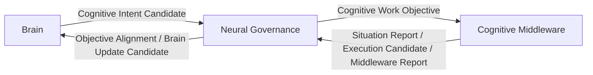

# Cognitive Work Objective Contract v1

## Three-layer contract

| Layer | Provides / consumes | Permitted responsibility | Prohibited responsibility |
|---|---|---|---|
| Brain | Provides Cognitive Intent; consumes Brain Update Candidate. | Defines cognitive purpose, context/goal relevance, attention input, and cognitive sufficiency. | Provider/model choice, execution organization, resource allocation. |
| Neural Governance | Produces CWO; consumes Middleware reports. | Translates intent, preserves semantic constraints, supervises alignment, aggregates feedback. | Goal replacement, provider invocation, Middleware execution control, truth/decision/action. |
| Middleware | Consumes CWO; produces situation/execution/report candidates. | Analyzes execution environment, decomposes work into capability candidates, resolves feasible organization. | Modifying CWO purpose, creating Goal, allocating cognitive Attention, cognitive completion judgment. |

## Contract invariants

1. `origin_intent` and `purpose` are immutable across the handoff; Middleware may only return feasibility, constraints, alternative capability candidates, or a refinement request.
2. Middleware cannot silently rewrite observation, relationship, unknown, or completion semantics.
3. CWO is candidate-shaped and trace-linked at every boundary.
4. Provider output returns through Middleware Report and Neural feedback handling; it does not enter Brain as a direct conclusion.
5. Reducer remains the sole State Mutation Authority.

## Permitted response to infeasibility

If Middleware cannot satisfy a CWO under current constraints, it returns a `constraint_candidate`, `degradation_candidate`, `alternative_capability_candidate`, or `refinement_request_candidate`. Neural and Brain retain responsibility for interpreting the implication.
