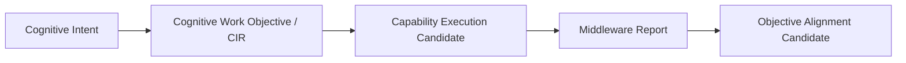

# Cognitive Work Objective Model v1

## Phase

`Phase-Cognitive-Work-Objective-and-Middleware-Operating-Model-Architecture-v1-001`  
Execution mode: V0 — architecture planning and static validation only.

## Definition

A **Cognitive Work Objective (CWO)** is the Cognitive Intermediate Representation (CIR) between a Brain Cognitive Intent and Middleware capability-execution organization. It expresses the bounded understanding work required, the evidence/relationship coverage expected, the unknown to reduce, and the conditions under which the work may be reported as covered.

## Not a plan or authority source

CWO is not:

- a Goal;
- a Task Plan;
- an Action Plan;
- a Decision;
- a Provider/model selection;
- a hardware/device instruction;
- a Reality or Truth assertion.

It is a portable cognitive-work contract: Brain intent is expressed in a form the Middleware can consume without exposing models/providers directly to the Brain.

## Canonical fields

| Field | Meaning |
|---|---|
| `work_objective_id` | Immutable identity for this objective candidate. |
| `origin_intent` | Parent Cognitive Intent reference and provenance. |
| `purpose` | Why this bounded understanding work is needed. |
| `required_understanding` | Required local understanding outcome, stated as candidate coverage. |
| `observation_requirement` | Required evidence/observation scope and quality. |
| `relationship_requirement` | Spatial, temporal, interaction, or causal-candidate relationships sought. |
| `unknown_target` | Unknown intended to be reduced. |
| `priority` | Requested work priority candidate, never Attention authority. |
| `depth_requirement` | Required evidence/understanding depth within A-route constraints. |
| `completion_condition` | Candidate condition for reporting work coverage. |
| `constraint` | Resource, latency, safety, scope, and protocol bounds. |
| `trace` | Parent context, lifecycle, protocol, and provenance references. |

## Lifecycle

`Created → admitted as protocol-valid → consumed by Middleware → execution candidates reported → alignment candidate → refined or closed`

Closing a CWO does not conclude a Brain goal, establish truth, mutate state, or execute an action.
