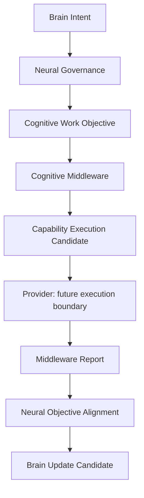

# Cognitive Work Objective Whitebox v1

## Purpose

The future whitebox shows the Brain-to-Middleware work contract and the origin of all returned coverage/gap candidates. It explains *why a capability organization exists*, not merely which models were invoked.

## Required trace panels

| Panel | Show |
|---|---|
| Brain Intent | Purpose, relevant context, uncertainty target, constraints, and trace parent. |
| CWO / CIR | Required understanding, observation/relationship requirements, completion condition, depth, and scope. |
| Middleware Situation Report | Availability, degradation, resource constraints, failure, and alternative candidates. |
| Objective Decomposition | Capability-work candidates and their coverage/dependency rationale. |
| Capability Execution Candidate | Expected evidence, resource/risk estimate, fallback, provider candidate, and non-execution status. |
| Middleware Report | Completed/missing coverage, conflict, failure, degradation, remaining unknown, alternatives. |
| Neural Alignment | Continue/refine/attention-adjustment/close candidates and their objective references. |
| Brain Update | Candidate handoff only; no state mutation, decision, or action displayed. |

## Display invariants

- Model/provider names are supporting details, never the primary cognitive narrative.
- Every item exposes source, destination, lifecycle, authority envelope, and trace provenance.
- Evidence, coverage, confidence, completion, and interpretation are visibly distinguished.
- No panel may present provider output as Truth or execution completion as cognitive completion.
