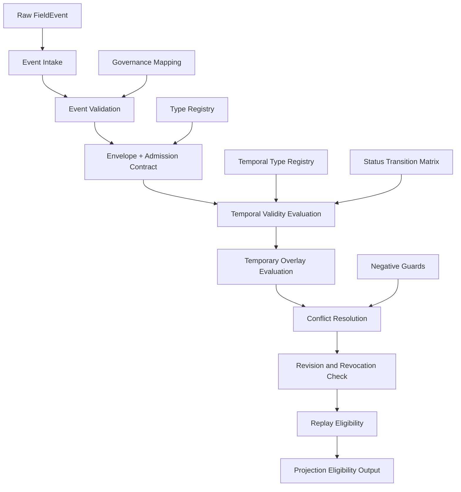

# Field Event Protocol Diagram v1

```mermaid
flowchart TD
    A[Raw FieldEvent] --> B[Event Intake]
    B --> C[Event Validation]
    C --> D[Envelope + Admission Contract]
    D --> E[Temporal Validity Evaluation]
    E --> F[Temporary Overlay Evaluation]
    F --> G[Conflict Resolution]
    G --> H[Revision and Revocation Check]
    H --> I[Replay Eligibility]
    I --> J[Projection Eligibility Output]

    K[Type Registry] --> D
    L[Temporal Type Registry] --> E
    M[Status Transition Matrix] --> E
    N[Governance Mapping] --> C
    O[Negative Guards] --> G
```

## Notes
- 该图仅描述规划层输出合同，不实现 Reducer、Runtime、数据库或调度器。
- 所有状态变化前置事件审查，且 replay 必须 deterministic。
