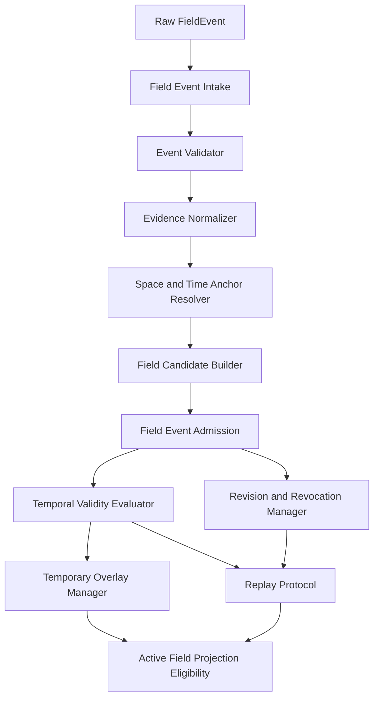

# Field Event and Temporal Validity Protocol Architecture Diagram v1

## Notes
- 该图展示了协议中事件从 Intake 到 Admission，再到 Temporal、Overlay、Revision 与 Projection 的路径。
- Replay 与 Revision 使用相同事件历史轨迹注意力。
- Overlay 管理不改变基础 substrate 定义。
