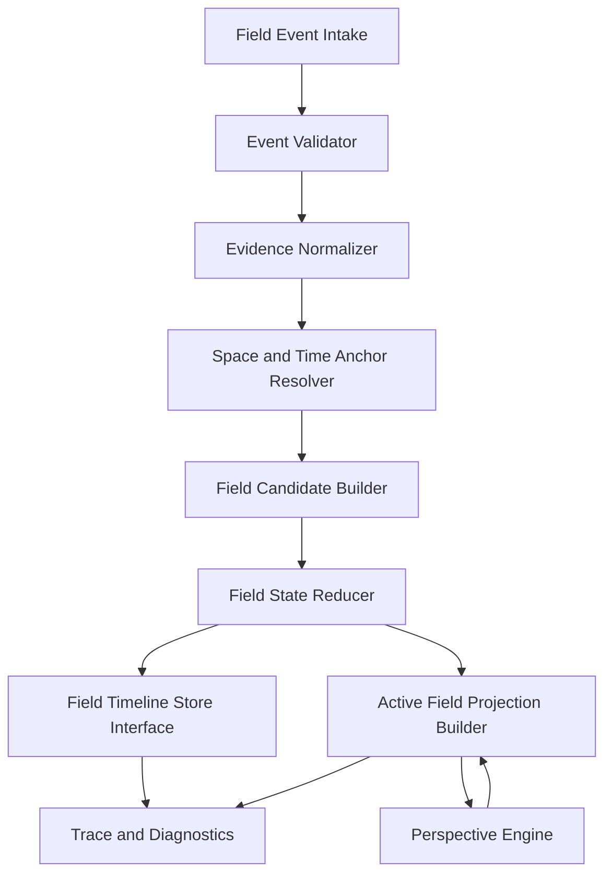
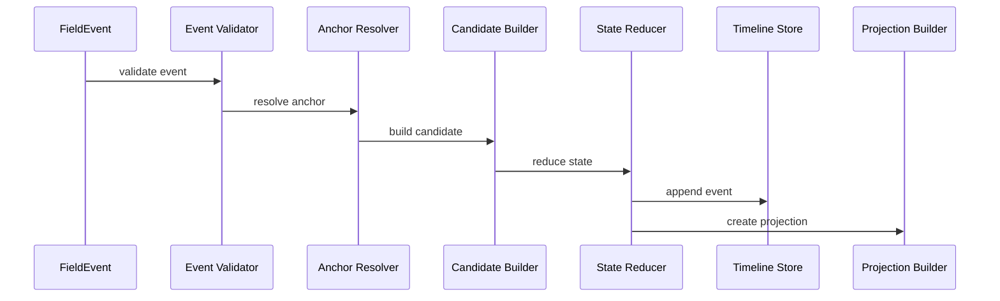
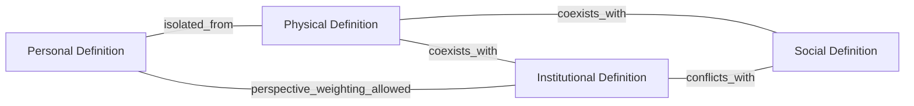
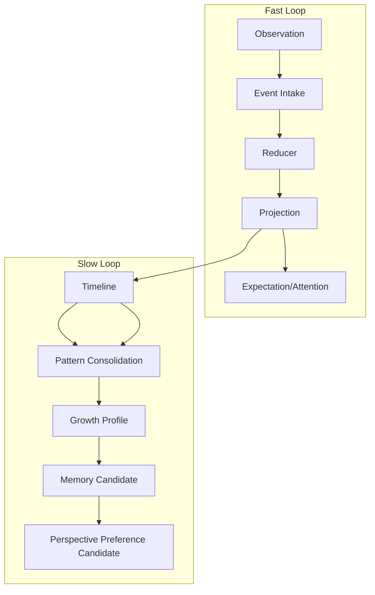
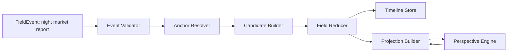

# Field Kernel Architecture Diagrams v1

## Field Kernel Overall Architecture

```mermaid
flowchart TD
  A[Field Event Intake] --> B[Event Validator]
  B --> C[Evidence Normalizer]
  C --> D[Space and Time Anchor Resolver]
  D --> E[Field Candidate Builder]
  E --> F[Field State Reducer]
  F --> G[Field Timeline Store Interface]
  F --> H[Active Field Projection Builder]
  H --> I[Perspective Engine]
  I --> H
  G --> J[Trace and Diagnostics]
  H --> J
```

## Event-Sourced State Update

```mermaid
sequenceDiagram
  participant Event as FieldEvent
  participant Validator as Event Validator
  participant Resolver as Anchor Resolver
  participant Builder as Candidate Builder
  participant Reducer as State Reducer
  participant Timeline as Timeline Store
  participant Projection as Projection Builder

  Event->>Validator: validate event
  Validator->>Resolver: resolve anchor
  Resolver->>Builder: build candidate
  Builder->>Reducer: reduce state
  Reducer->>Timeline: append event
  Reducer->>Projection: create projection
```

## Multi-Reality Coexistence

```mermaid
graph LR
  P[Physical Definition]
  I[Institutional Definition]
  S[Social Definition]
  R[Personal Definition]
  P ---|coexists_with| I
  P ---|coexists_with| S
  I ---|conflicts_with| S
  R ---|isolated_from| P
  R ---|perspective_weighting_allowed| I
```

## Fast Loop / Slow Loop

```mermaid
flowchart TB
  subgraph Fast Loop
    O[Observation] --> EI[Event Intake]
    EI --> RR[Reducer]
    RR --> AP[Projection]
    AP --> EA[Expectation/Attention]
  end
  subgraph Slow Loop
    TL[Timeline] --> PC[Pattern Consolidation]
    PC --> GP[Growth Profile]
    GP --> MC[Memory Candidate]
    MC --> PP[Perspective Preference Candidate]
  end
  AP --> TL
  TL --> PC
```

## 小北门 Case Flow

```mermaid
flowchart LR
  FE[FieldEvent: night market report] --> EV[Event Validator]
  EV --> AR[Anchor Resolver]
  AR --> CB[Candidate Builder]
  CB --> FR[Field Reducer]
  FR --> TB[Timeline Store]
  FR --> AP[Projection Builder]
  AP --> PE[Perspective Engine]
  PE --> AP
```
