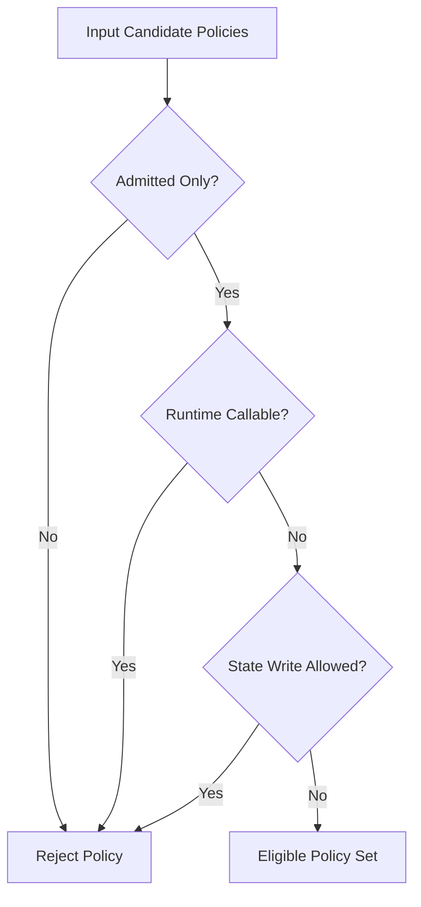
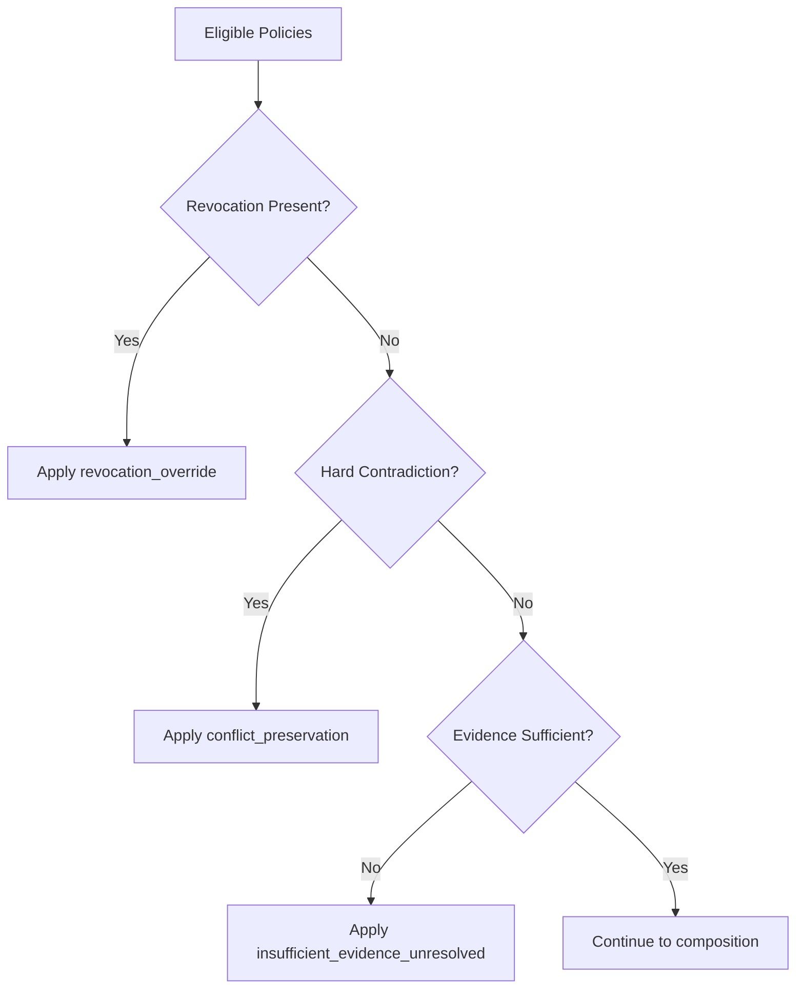
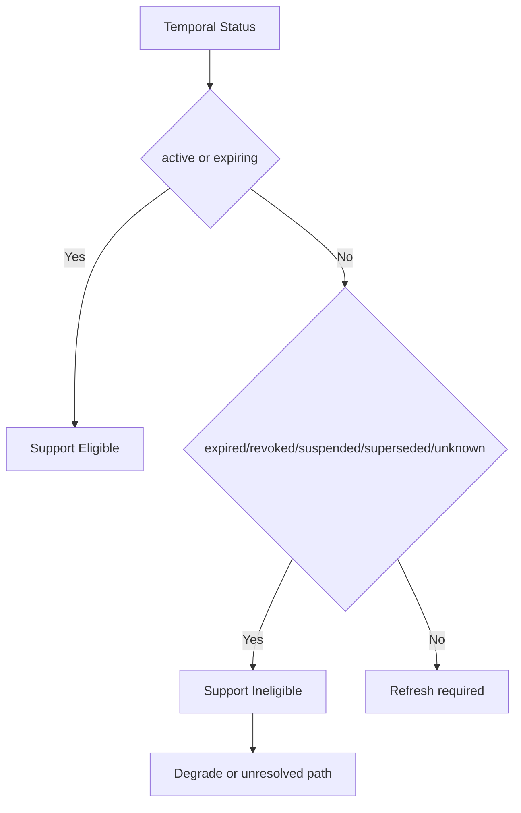
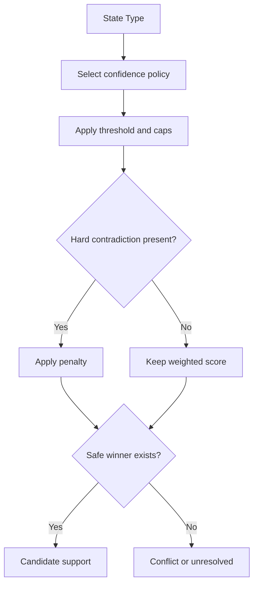
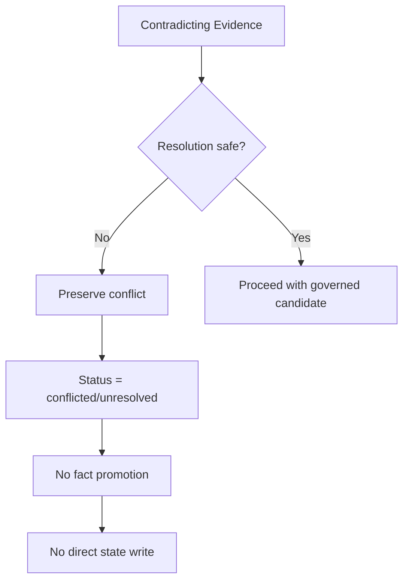
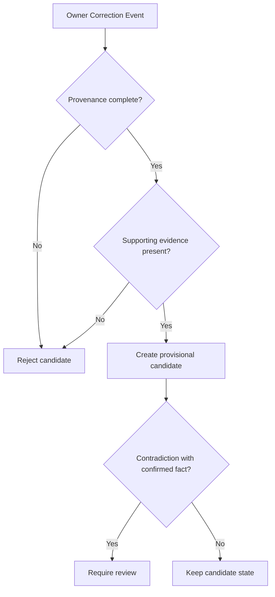
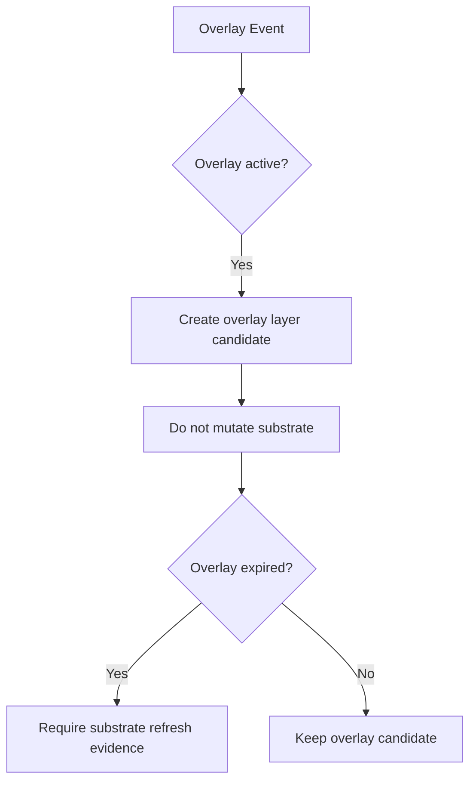
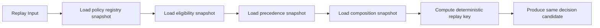

# Field State Reducer Behavior Policy Diagram v1

本文件仅用于 Technical Planning，可视化策略选择与约束，不表示 Runtime 已实现。

## 1) Policy Eligibility Flow

## 2) Precedence Resolution Flow

## 3) Composition Contract Flow

```mermaid
flowchart LR
    A[Policy Sequence Start] --> B[revocation_override]
    B --> C[conflict_preservation]
    C --> D[expiration_degrade]
    D --> E[temporary_overlay_separation]
    E --> F[multi_event_consensus]
    F --> G[highest_confidence_valid_event]
    G --> H[latest_valid_event]
    H --> I[explicit_owner_override_candidate]
    I --> J[insufficient_evidence_unresolved]
    J --> K[negative_event_override]
    K --> L[no_state_change]
```

## 4) Temporal Gate Flow

## 5) Confidence Handling Flow

## 6) Conflict Preservation Flow

## 7) Owner Correction Governance Flow

## 8) Overlay Separation Flow

## 9) Replay Determinism Flow

