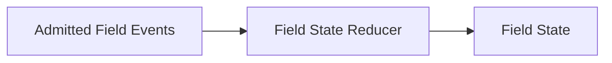
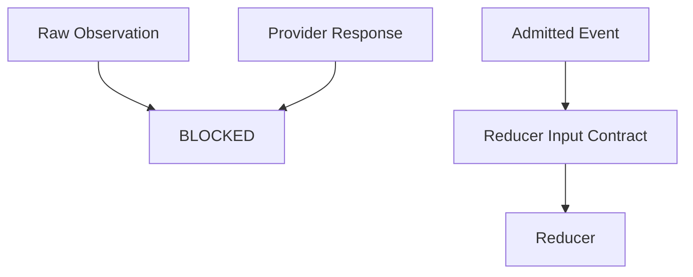
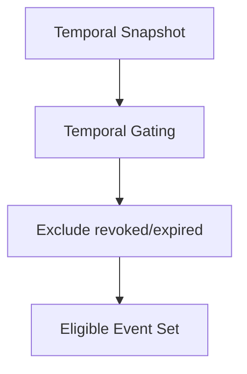
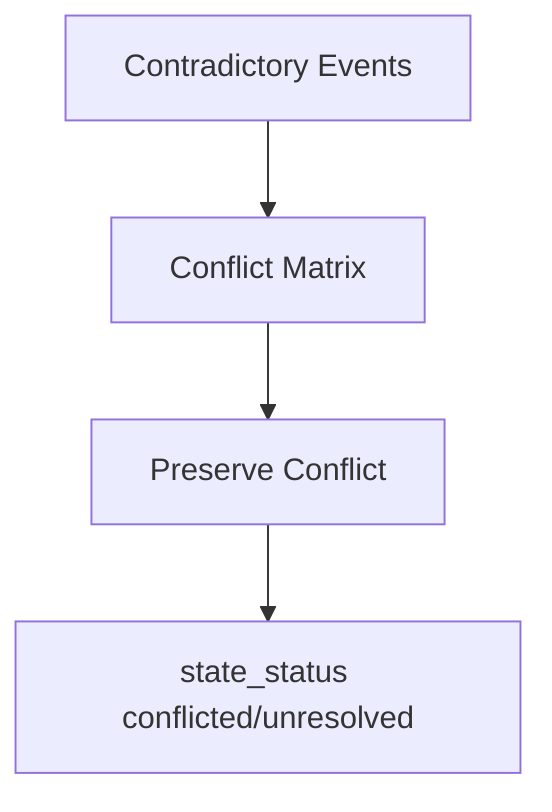
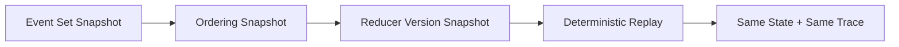
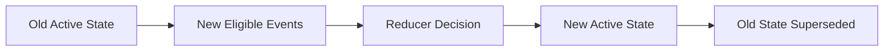
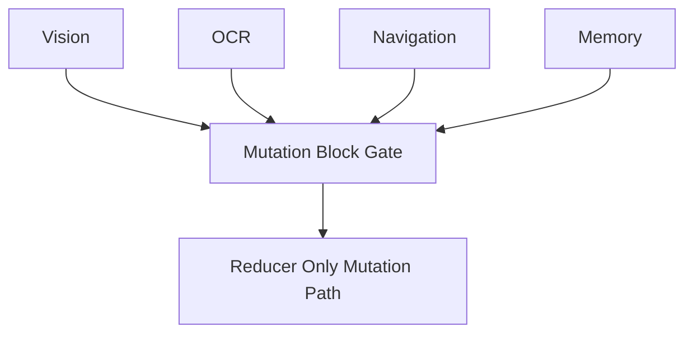

# Field State Reducer Protocol Diagram v1

## Event -> Reducer -> State 主链

## Input Admission Boundary

## Temporal Reduction Flow

## Conflict Preservation Flow

## Replay Flow

## State Supersession Flow

## Illegal Direct Mutation Blocking

