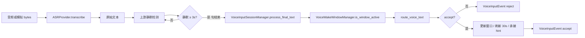

# Luna 语音输入主线 v1 — 变更清单

## 1. 新增/强化的代码对象

| 路径 | 职责 |
|------|------|
| `capabilities/voice/runtime/voice_wake_window_manager.py` | 会话窗口：`inactive` / `active_window` / `expired`；30 秒刷新；关机/待机/结束对话清空 |
| `capabilities/voice/runtime/voice_shortcut_registry.py` | 白名单注册表与 `match()`（最长短语优先） |
| `capabilities/voice/runtime/voice_segment_timeout_policy.py` | **3 秒**静默切段策略（仅句结束，不管 30 秒窗口） |
| `capabilities/voice/runtime/voice_input_session_manager.py` | 串联路由 + 窗口 + 承接 hint → `VoiceInputEvent` |
| `capabilities/voice/bridge/voice_input_router.py` | 三入口路由：`route_voice_text` → accept/reject |
| `capabilities/voice/providers/mock_asr_provider.py` | 最小 `ASRProvider` 形态：UTF-8 bytes → 文本 |
| `capabilities/voice/schemas/voice_input_event.py` | 扩展 v1 字段（`wake_word`、`active_window`、`shortcut_id`、`router_decision`、`context_resume_hint` 等） |
| `capabilities/voice/interfaces/asr_provider.py` | 既有 `ASRProvider` 协议（保持不变，产出 `VoiceInputEvent`） |
| `tests/test_voice_input_mainline_v1.py` | 场景 1–8 + Mock ASR + 唤醒词常量 |

## 2. 输入主线流转图（逻辑）

**两层时间**：

- **3s**：切段 —— 「这句说完了」→ 调用 `process_final_text`（见 `VoiceSegmentTimeoutPolicy`）。
- **30s**：会话 —— 「免唤醒连续对话」窗口；每次 **有效 accept** 刷新（见 `VoiceWakeWindowManager`）。

## 3. ASR 接入程度

- **已完成**：`ASRProvider` 协议 + `MockASRProvider`（UTF-8 解码为文本）+ `VoiceInputEvent` 最小字段。
- **未做**：真实云端 ASR、流式 partial、端侧唤醒词检测（「艾达」当前在 **文本路由层** 匹配）。

## 4. 当前不支持（与 v1 边界一致）

- 自由闲聊、情感分析、长语音 LLM 拆解、复杂多轮对话  
- 云端 ASR / 生产级 TTS 主链  
- UI 与输出主链重构  

## 5. 预留扩展（文档级，未实现）

1. **大模型长语音拆解** → 关键词 / 任务动作（输入扩展层）  
2. **更强短期记忆** → 与任务链/快照深度联动  
3. **复杂意图冲突判定** → 行为 / 任务 / 环境综合确认  

---

说明文档：[LUNA_VOICE_INPUT_MAINLINE_V1.md](./LUNA_VOICE_INPUT_MAINLINE_V1.md)  
白名单：[LUNA_VOICE_SHORTCUT_WHITELIST_V1.md](./LUNA_VOICE_SHORTCUT_WHITELIST_V1.md)
